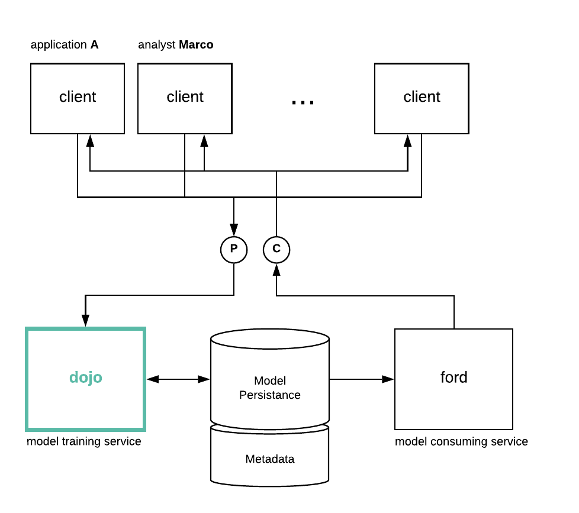

# 🥋 dojo
A service to receive model artefacts and training recipes to  machine learning models asynchronously 

## Macro architecture

Dojo attempts to centralize time and resource consuming training steps in machine learning projects

The context in which `dojo` is relevant is shown above.

A service to support data scientists with pragmatic issues:

1. Reduces overhead when training complex models
2. Drastically minimizes model training ETA
3. Centralized model storage enables
   1. continuous improvement (testing) pipelines,
   2. ensure reproducibility,
   3. encourages peer-review 

## Architecture

Server looks for *messages* on a subscription-bus and, when one arrives, artefacts are properly receieved and stored. A message receieve event triggers *job* creation -- instruction for a group of workers -- which is placed on an execution queue.

Workers are constantly fetching for jobs to run and, when one arrives, retrieves artefacts required to execute said job. Workers may (not sure?) write metadata as a stream of messages, i.e. `stdout`, in a way that Server can expose training logs. 

## Requirements

Roadmap can be summarized as follows:

1. [x] Idea
2. Architecture
   1. [x] Design
   2. [ ] **Validate**
   3. [ ] Specify & prototype
2. Environment
   1. [x] Language: python fs
   2. [ ] Deployment: local docker-compose
   3. Development
      1. [ ] Patterns and protocols
      2. [ ] Server
      3. [ ] Job queue
      4. [ ] Workers
   4. [ ] Tests

## Tests

##### LOAD TEST: Concurrency

Perform simultaneous requests for each endpoint that is known to call complex enough chunks of code.

##### FAULT TOLERANCE: Failure recovery

Simulate scenarios that specifics components fail to ensure core system robustness.

#### INTEGRATION: Feature testing

Simulate expected scenarios that features are supposed to work
